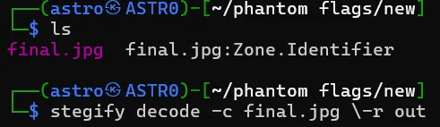
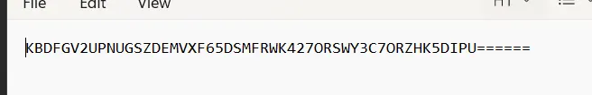

# Easyy Bruhh

**Category:** Forensics  
**Points:** 100  
**Difficulty:** Easy

---

## Challenge Description

You are given an image file. Extract the hidden flag using steganography tools.

---

## Solution

### Step 1: Analyze the Given Image

After downloading the challenge file, we find an image named `final.jpg`. Let's first check what files we have:

```bash
ls
```



### Step 2: Extract Hidden Data Using Stegify

Using the `stegify` tool to decode the hidden data from the image:

```bash
stegify decode -c final.jpg -r out
```

This extracts the hidden content from the image file.

### Step 3: Discover the Encoded String

After extraction, we find a Base32 encoded string:



```
KBDFGV2UPNUGSZDEMVXF65DSMFRWK427ORSWY3C7ORZHK5DIPU======
```

### Step 4: Decode the Base32 String

The `======` padding at the end is a clear indicator of Base32 encoding. Decode it using:

```bash
echo "KBDFGV2UPNUGSZDEMVXF65DSMFRWK427ORSWY3C7ORZHK5DIPU======" | base32 -d
```

Or use CyberChef/online Base32 decoder.

---

## Flag

```
PFSWT{hidden_traces_tell_truth}
```

---

## Tools Used

- **stegify** - Steganography tool for hiding/extracting data in images
- **base32** - Command line tool for Base32 encoding/decoding

---

## Learning Points

- Steganography is the practice of hiding data within other data (images, audio, etc.)
- Base32 encoding uses characters A-Z and 2-7, with `=` padding
- Always check the encoding type by looking at character patterns and padding
- Tools like `stegify`, `steghide`, and `zsteg` are essential for image steganography

---

## Tips

1. When you see a string ending with multiple `=` signs, try Base32 or Base64 decoding
2. Base32 strings contain only uppercase letters A-Z and digits 2-7
3. Different steganography tools work on different file formats - try multiple tools if one doesn't work
