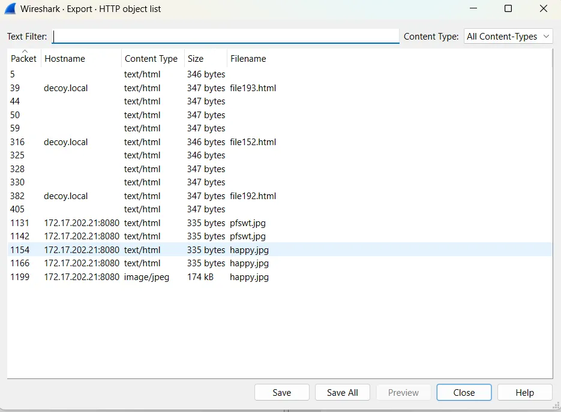
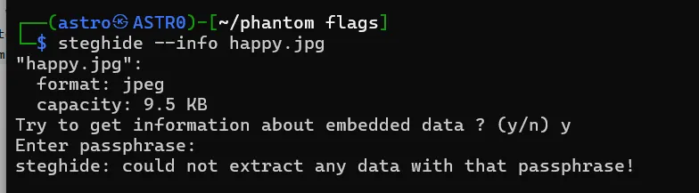
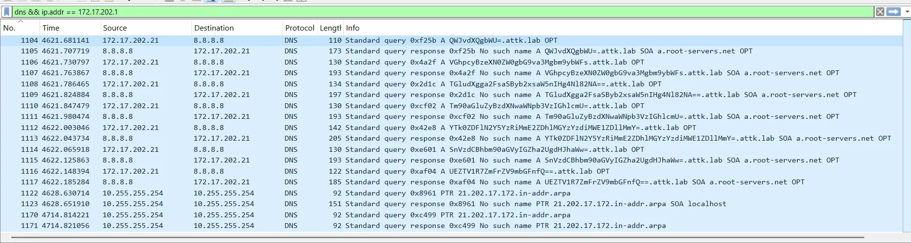
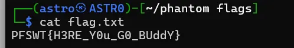

# Silent Harvest

**Category:** Forensics  
**Points:** 500  
**Difficulty:** Hard

---

## Challenge Description

You are provided with a PCAP file. Analyze the network traffic to find the hidden flag.

---

## Solution

### Step 1: Open the PCAP File in Wireshark

Load the provided PCAP file in Wireshark for analysis.

### Step 2: Export HTTP Objects

Navigate to **File → Export Objects → HTTP** to see all HTTP objects transferred in the capture.



We can see several interesting files, including `happy.jpg` being served from `172.17.202.21:8080`.

### Step 3: Extract the Image File

Save the `happy.jpg` file from the HTTP export list.

### Step 4: Analyze the Image with Steghide

Check if the image contains hidden data using steghide:

```bash
steghide --info happy.jpg
```



The output shows:
- Format: JPEG
- Capacity: 9.5 KB
- **Embedded data requires a passphrase!**

We need to find the password to extract the hidden content.

### Step 5: Analyze DNS Traffic

Going back to Wireshark, we analyze DNS traffic from the same IP address. Apply the filter:

```
dns && ip.addr == 172.17.202.1
```



We notice suspicious DNS queries with Base64-encoded subdomains being sent to `.attk.lab`. This is a classic **DNS exfiltration** technique!

### Step 6: Decode the DNS Exfiltration Data

Extract and decode the Base64 subdomains from the DNS queries:

| DNS Query Subdomain | Decoded Content |
|---------------------|-----------------|
| `QWJvdXQgbWU=` | About me |
| `VGhpcyBzeXN0ZW0gd29ya3Mgbm9ybWFs` | This system works normal |
| `TGludXgga2FsaSByb2xsaW5nIHg4Nw==` | Linux kali rolling x87 |
| `Tm90aGluZyBzdXNwaWNpb3Vz` | Nothing suspicious |
| `YTI0ZDFuN2Y5YzRiMmE2OGUwZjNjN2IxYTVkMjVm` | a24d1u7f9c4b2a68e0f3c7b1a5d25f |
| `SnVzdCBhbm90aGVyIGZha2UgZmxhZw==` | Just another fake flag |
| `UEZXVHtmYWtlX2ZsYWd9` | PFWT{fake_flag} |

The decoded messages reveal:
```
About me
This system works normal
Linux kali rolling x87
Nothing suspicious
a24d1u7f9c4b2a68e0f3c7b1a5d25f
Just another fake flag
PFWT{fake_flag}
```

### Step 7: Identify the Password

Among the decoded data, we find a suspicious hash-like string:
```
a24d1u7f9c4b2a68e0f3c7b1a5d25f
```

This looks like a password! The other entries are decoys to mislead us.

### Step 8: Extract the Flag Using Steghide

Use the discovered password to extract hidden data:

```bash
steghide extract -sf happy.jpg -p "a24d1u7f9c4b2a68e0f3c7b1a5d25f"
```

This extracts a `flag.txt` file:

```bash
cat flag.txt
```



---

## Flag

```
PFSWT{H3RE_Y0u_G0_BUddY}
```

---

## Tools Used

- **Wireshark** - Network protocol analyzer for PCAP analysis
- **steghide** - Steganography tool for JPEG files
- **Base64 decoder** - For decoding exfiltrated DNS data

---

## Learning Points

1. **DNS Exfiltration** - Data can be hidden in DNS query subdomains, encoded in Base64
2. **HTTP Object Export** - Wireshark can extract files transferred over HTTP
3. **Steganography with Passwords** - Tools like steghide can protect hidden data with passphrases
4. **Decoy Data** - Attackers often include fake flags and misleading information

---

## Attack Techniques Demonstrated

| Technique | Description |
|-----------|-------------|
| DNS Exfiltration | Hiding data in DNS query subdomains |
| Steganography | Concealing files within image files |
| Misdirection | Using fake flags to confuse analysts |

---

## Tips

1. When analyzing PCAP files, always export HTTP objects first
2. Check for unusual DNS patterns - long subdomains often indicate exfiltration
3. Base64 encoded strings can be identified by their character set (A-Za-z0-9+/) and `=` padding
4. Don't trust obvious flags - verify they match the expected format
5. Hidden passwords often look like hashes (32 hex characters = MD5, etc.)
